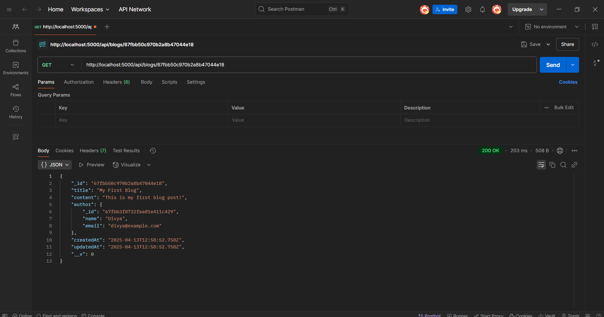

# Blog API
This is a RESTful API built with Node.js, Express, and MongoDB to manage blog posts. The API supports CRUD operations (Create, Read, Update, Delete) and provides JWT authentication for secure user access. It's designed to be the backend for a blogging platform, allowing users to register, login, and create/edit/delete blog posts. The API also handles user authentication and ensures data security using bcryptjs for password hashing.

# screentshot

# Features:
User Authentication with JWT and password encryption (bcryptjs)
CRUD operations for blog posts
Secure API routes with role-based access control
RESTful endpoints for handling blog data (posts, users)
Integration with MongoDB for data storage

# Tech Stack:
- Node.js
- Express.js
- MongoDB (with Mongoose)
- JWT (for authentication)
- bcryptjs (for password hashing)

# Clone the repository:
bash: git clone https://github.com/yourusername/blog-api.git

# Install dependencies:

bash: npm install

* Set up your environment variables (refer to .env.example).

# Start the server:

bash: npm start